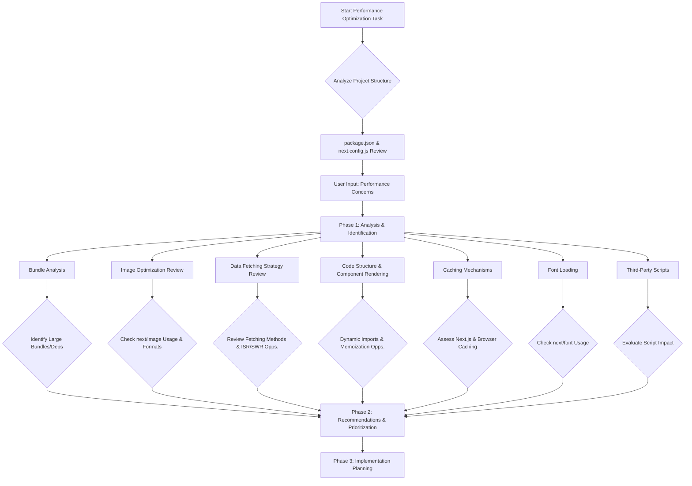

# Project Optimization Plan

This document outlines the plan to identify and implement performance optimizations for the Next.js project.

## Phase 1: Analysis & Identification

1.  **Bundle Analysis:**
    - Analyze JavaScript bundle sizes using tools like `@next/bundle-analyzer` to identify any large dependencies or custom components that might be slowing down initial load times.
2.  **Image Optimization Review:**
    - Check how images are being handled. Ensure `next/image` is used effectively across the site for all images, including local ones.
    - Verify proper sizing, formats (like WebP), and lazy loading.
3.  **Data Fetching Strategy Review:**
    - Examine how data is fetched on different pages (e.g., using `getServerSideProps`, `getStaticProps`, client-side fetching with SWR/React Query, or Next.js App Router's server components and actions).
    - Identify opportunities for more efficient data loading patterns like Incremental Static Regeneration (ISR) or optimizing client-side requests.
4.  **Code Structure & Component Rendering:**
    - Look for opportunities for code splitting using dynamic imports (`next/dynamic`) for components that are not critical for the initial view.
    - Review React component rendering patterns for potential optimizations (e.g., memoization).
5.  **Caching Mechanisms:**
    - Assess how Next.js's built-in caching is being utilized.
    - Explore opportunities for browser caching and potentially server-side caching for API routes or frequently accessed data.
6.  **Font Loading:**
    - Ensure fonts are loaded efficiently, ideally using `next/font` to prevent layout shifts and optimize loading.
7.  **Third-Party Scripts:**
    - Identify any third-party scripts and evaluate their performance impact.

## Phase 2: Recommendations & Prioritization

1.  Based on the analysis, provide specific, actionable recommendations for each area.
2.  Prioritize these recommendations based on their potential impact and ease of implementation.

## Phase 3: Implementation

1.  Once the plan and priorities are set, the actual code changes will be implemented (typically in a 'code' or similar specialized mode).

## Visual Plan

